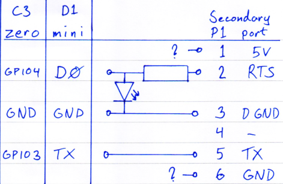

# P1 Passthrough
It is possible to attach another P1 reading device in case you need to connect a car charger (or a second p1-mini...) etc.

### Parts
- Female connector for the RJ12 cable.
- White (or blue) LED
- Resistor 1 - 3 kΩ

The LED will, in addition to providing visual indication that updates are beeing requested on the port, ensure that the voltage on the ESP input pin will not get high enough to damage it. The LED needs to have a high enough voltage drop and some colors may not work.

The value of the resistor is not very critical. I have tested with 3 kΩ and anything down to 1 kΩ should be fine.

A p1mini wired up with a secondary port (unpowered) on an experimental board:

### Power to the secondary port

Power to the secondary port needs to be supplied from a secondary source (such as an USB charger). Unless the secondary device is already powered (like a car charger etc) in which case it may not be necessary to supply any power at all to the secondary port.
