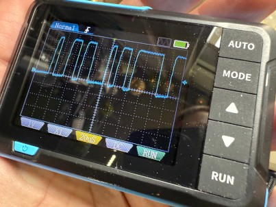
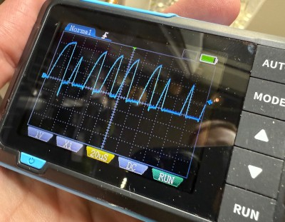

# Troubleshooting
Things to check if something is not working:

## WiFi
Make sure the p1mini is connecting to your WiFi:
* Access the web browser on the P1mini: (usually) http://p1mini.local/
* Temporarily move it closer to the router, in case it is out of range.
* etc

## Log
Check the log (and probably set the log level to DEBUG in the yaml file).

### No data received...
If you see `No data received for 60 seconds.` in the log, no data at all is beeing received.
* Verify that the port is enabled. Check with the supplier.
* Check that the correct pin is soldered in the right place.
* If you can, inspect the signal with an oscilloscope. The signal should consist of distinct pulses at around 3.3V:

### Unknown data format...
If you see `Unknown data format (0x??). Resetting.`, followed by a lot of `Discarding: ...`, then data is beeing received but it is incorrect in some way.

If you are inverting the signal in hardware (using a transistor etc) make sure that you are not also inverting in the yaml.

If the discarded data contains a lot of "weird" sequences, like `c3e3c3c3c3c3`, `f8f8ffff`, etc, it is likely that the internal pullup resistor in the ESP chip is not effective at the data rates used by the serial communication. When looking at the signal it might look like this:

In many cases, this can be fixed by adding an external resistor between 3.3V and the input pin (RX on a D1 mini, GPIO1 on the ESP32-C3-Zero) on the ESP module. Lower resistances are more "aggressive" and I would not recommend going below 500Ω but in many cases values as high as 5kΩ work fine!

